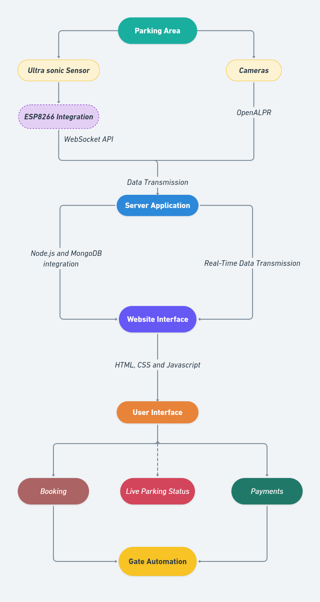

# 🚗 Smart Car Parking System – Project Deep Blue (Mastek)


<div align="center" style="margin-bottom:5px">

  
**Season 9 | Shortlisted Abstract**  
**Team from KET’s V. G. Vaze College**

</div>

---

## 📌 About Project Deep Blue – Mastek

[Project Deep Blue](https://deepblue.co.in/) is Mastek's flagship social innovation initiative that challenges engineering students across India to develop real-world tech solutions with a positive social impact. Since its inception in 2015, the initiative has grown to involve over 12,000 students, fostering innovation using modern technologies like AI, IoT, ML, and Web development.

**🕒 Season 9 Time Period: March 2023 – June 2024**<br>
- Season 9 focused on solving challenges such as urban sustainability, digital inclusion, and smart city solutions — helping students bridge the academia-industry gap with hands-on mentorship.

---

## 🧠 Problem Statement

**Finding a Car Parking Spot at Mastek**

In modern urban environments — especially within large campuses, malls, or IT hubs — searching for a parking spot wastes time, fuel, and contributes to traffic congestion and pollution. The aim is to design an **automated and intelligent parking solution** using IoT and web technologies to ease this persistent issue.

[🖺 Read the Problem Statement](Finding%20a%20Car%20parking%20spot%20at%20Mastek.docx)
-
---

## 🙋🏻🔍 Our Approach

Our system is a **real-time car parking management solution** powered by:
- **Ultrasonic sensors** and **ESP8266 microcontrollers** for live slot detection.
- A **web application** for checking availability, pre-booking slots, online payments, and receiving notifications.
- Integration of **camera systems** for license plate recognition (via Python's OpenALPR).
- **Servo motors** for automated gate access.
- Real-time database updates via **Firebase** or **WebSocket API**.


[🖺 Proposed Solution](Finding%20a%20Car%20parking%20Abstract.pdf)
-
---

## 🛠️ Technologies Used

| Layer | Tools / Languages |
|-------|--------------------|
| Frontend | HTML, CSS, JavaScript |
| Backend | Node.js, PHP |
| Microcontroller | ESP8266 (C++ via Arduino IDE) |
| Real-time DB/API | WebSocket API / Google Firebase |
| Camera | Python (OpenALPR) |
| Payment APIs | Paytm, Google Pay (integration optional) |
| Database | MongoDB, MySQL |

---

## 🧩 System Architecture


``` yaml
[Sensor Data] → ESP8266 → Server (via Firebase/WebSocket)
↓
[Database: MongoDB + MySQL]
↓
[Web Interface: Booking | Payment | Notification]
↓
[Camera + OpenALPR] → License Plate Capture
↓
[Gate Access via Servo Motor]
```


---

## 🗓️ Development Timeline (14 Weeks Plan)

| Phase | Target |
|-------|--------|
| Week 1–2 | ESP8266 Setup + Sensor Calibration |
| Week 3–4 | Backend + Database (MySQL + MongoDB) |
| Week 5–6 | Frontend Integration with Real-Time Updates |
| Week 7–8 | Implement Firebase/WebSocket Communication |
| Week 9–10 | Integrate Payment Gateway + LPR Camera |
| Week 11–12 | Servo Motor Automation for Gates |
| Week 13–14 | Testing + User Feedback & Iteration |

---

## 🎯 Motivation

We chose this problem for its **universal relevance**. Urbanization demands sustainable solutions, and smart parking is a step toward a greener, stress-free urban experience. We believe our idea can contribute to traffic decongestion, better fuel efficiency, and smarter urban infrastructure.

---

## 📷 Screenshots & Diagrams

> _Approach Diagram_

| 🧾 Approach Diagram |
|:--------------------:|
|  |

---

> 🧠 _“Innovation is seeing what everybody has seen and thinking what nobody has thought.”_  
> — Dr. Albert Szent-Györgyi
